# MyBag

MyBag is an ecommerce website where different bags for different occassions can be bought.

View the live project here: <>

## Table of content

- [MyBag](#mybag)
  - [Table of content](#table-of-content)
  - [UX](#ux)
    - [Website owner goals](#website-owner-goals)
    - [E-commerce application type](#e-commerce-application-type)
    - [Agile planning](#agile-planning)
      - [Milestones](#milestones)
      - [User stories](#user-stories)
      - [Wireframes](#wireframes)
      - [Flow Chart](#flow-chart)
      - [Method](#method)
        - [POC (prove of concept)](#poc-(prove-of-concept))
        - [MVP (minimum viable product)](#mvp-(minimum-viable-product))
    - [Five planes of UX](#five-planes-of-UX)
      - [Strategy](#strategy)
      - [Scope](#scope)
      - [Structure](#structure)
      - [Skeleton](#skeleton)
      - [Surface](#surface)
  - [Features](#features)
    - [Welcome screen](#welcome-screen)
    - [Username](#username)
    - [Game rules](#game-rules)
    - [Game board](#game-board)
    - [User moves](#user-moves)
    - [Features left to implement](#features-left-to-implement)
  - [Used Technologies](#used-technologies)
    - [Languages Used](#languages-used)
    - [Framework, Libraries and Programs](#framework-libraries-and-programs)
  - [Testing](#testing)
    - [Manual testing](#manual-testing)
    - [Testing user stories](#testing-user-stories)
    - [Validator testing](#validator-testing)
    - [Unfixed bugs](#unfixed-bugs)
  - [Deployment](#deployment)
  - [Credits](#credits)
    - [Content](#content)
    - [Media](#media)
  - [Acknowledgements](#acknowledgements)

## UX

### Website owner goals

As the owner of the website I want to sells different bags for everyone:
- Within the first two month I want to sell 100 bags.
- Within the first six month I want to have 100 registered repeat buyers and I want to sell 1000 bags.
- Each month I want to have at least 100 persons visiting my website.

### E-commerce application Type

- **Who is the customer?:**  
    - It is a business to customer model (B2C). We have to attract the consumers to choose to make impulsive purchases. Our customers are going to be of all kind of genders and all ages. People who want to buy quality bags anytime or those who want to buy a bargain can find what they are looking for on the website. Therefore the customers can get different kinds of informations on the products on our website. 
- **What will they buy?:** 
    - The physical products we are selling are different bags for different occassions and customers.
- **How will they pay?:** 
    - The customers can pay via one time payment. They can save their payment methods to make it easier for the next time.
- **Type:** 
    - Our application type is a typical online shop (e-commerce).

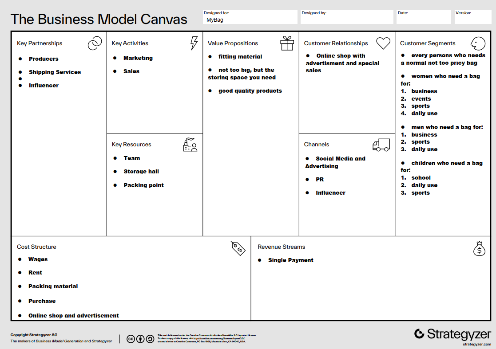

### Agile planning

The development of this project was done with an agile approach.

Here is an example of the Kanban board from an early development stage:
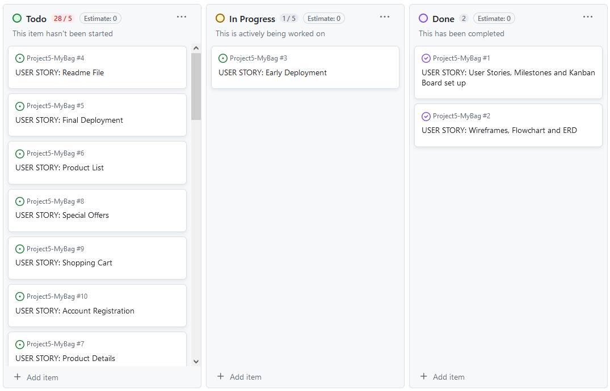

The project board can be found here: <https://github.com/users/RenaSchott/projects/5>.

#### Milestones
- **Preparation for P5:** All the preparation User Stories etc. is done for P5.
- **Deployment:** Early and final deployment for P5.
- **Viewing and navigation:** Built the site and fill it with products.
- **Registration and User Accounts:** Mahe a registration possible and create the user accounts with everything needed.
- **Sorting and Searching:** Make the site usable for shoppers.
- **Purchasing and Checkout:** Make the checkout and purchase of products possible
- **Admin and Store Management:** Make the site usabke for the store owner

The milestones can be found here <https://github.com/RenaSchott/Project5-MyBag/milestones>.

#### User stories

The user stories can be found here <https://github.com/RenaSchott/Project5-MyBag/issues>.

- As a developer I want to be able to write User Stories, Milestones and set up the Kanban Board for the project so that I can keep track of the progress of the project.
- As a developer I want to be able to use wireframes, flowchart and ERD so that I can built the wanted site.
- As a developer I want to be able to deploy my project early so that I can find problems and avoid stress in the end.
- As a developer I want to be able to finish the Readme File so that I can finish the project.
- As a developer I want to be able to make the final deployment so that I can submit a working project.
- As a shopper I want to be able to view a list of products so that I can select some to purchase.
- As a shopper I want to be able to view individual product details so that I can identify the price, description, product rating, product image and available sizes.
- As a shopper I want to be able to quickly identify deals, clearance items and special offers so that I can take advantage of special savings on products I’d like to purchase.
- As a shopper I want to be able to easily view the total of my purchase at any time so that I can avoid spending too much.
- As a site user I want to be able to easily register for an account so that I can have a personal account and be able to view my profile.
- As a site user I want to be able to easily login or logout so that I can access my personal account information.
- As a site user I want to be able to easily recover my password in case I forget it so that I can recover access to my account.
- As a site user I want to be able to receive an email confirmation after registering so that I can verify that my account registration was successful.
- As a site user I want to be able to have a personalized user profile so that I can view my personal order history and order confirmations, and save my payment information.
- As a shopper I want to be able to sort the list of available products so that I can easily identify the best rated, best priced and categorically sorted products.
- As a shopper I want to be able to sort a specific category of product so that I can find the best-priced or best-rated product in a specific category, or sort the products in that category by name.
- As a shopper I want to be able to sort multiples categories of products simultaneously so that I can find the best-priced or best-rated products across broad categoried, such as „school bags“.
- As a shopper I want to be able to search for a product by name or description so that I can find a specific product I’d like to purchase.
- As a shopper I want to be able to easily see what I’ve searched for and the number of results so that I can quickly decide whether the product I want is available.
- As a shopper I want to be able to easily select the size and quantity of a product when purchasing it so that I can ensure I don’t accidentially select the wrong product, quantity or size.
- As a shopper I want to be able to view items in my shopping cart to be purchased so that I can identify the total cost of my purchase and all items I will receive.
- As a shopper I want to be able to adjust the quantity of individual items in my bag so that I can easily make changes to my purchase before checkout.
- As a shopper I want to be able to easily enter my payment information so that I can check out quickly and with no hassle.
- As a shopper I want to be able to feel my personal and payment information is safe and secure so that I can confidently provide the needed information to make a purchase.
- As a shopper I want to be able to view an order confirmation after checkout so that I can verify that I haven’t made any mistakes.
- As a shopper I want to be able to receive an email confirmation after checking out I want to be able to  so that I can keep the confirmation of what I’ve purchased for my records.
- As a store owner I want to be able to add a product so that I can add new items to my store.
- As a store owner I want to be able to edit/update a product so that I can change product prices, descriptions, images, and other product criteria.
- As a store owner I want to be able to delete a product so that I can remove items that are no longer for sale.
- As a store owner I want to be able to add/edit/delete a category so that I can change the items available in my store.
- As a store owner I want to be able to add/edit/delete advertisements so that I can promote different product or campaign.

#### Wireframes

Here are the drawings of the wireframes for the browsers and for smartphones:

**Homepage:**
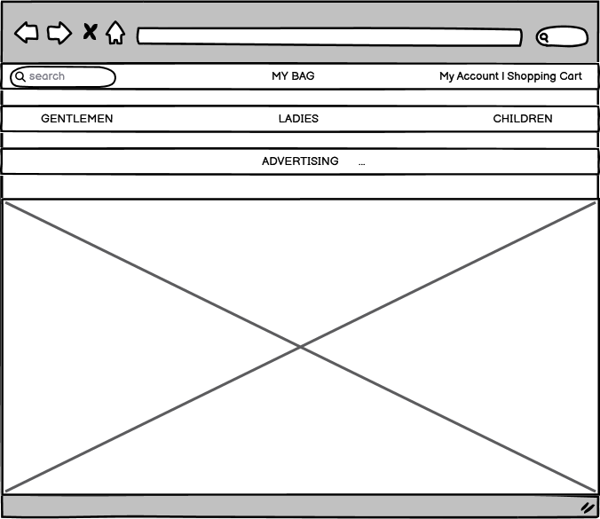
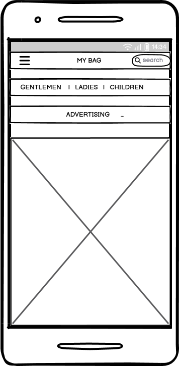

**Register:**
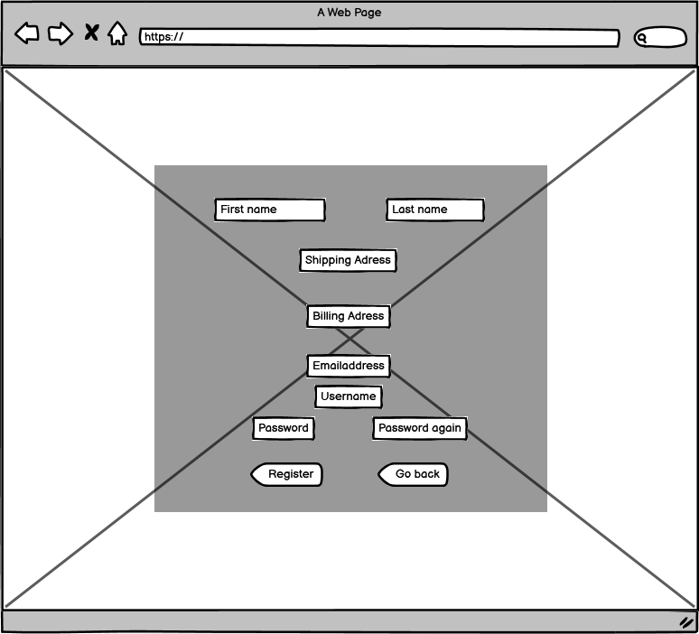
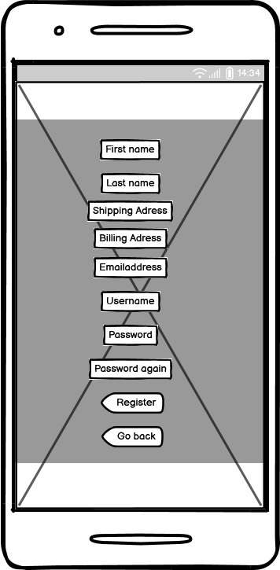

**Log In:**
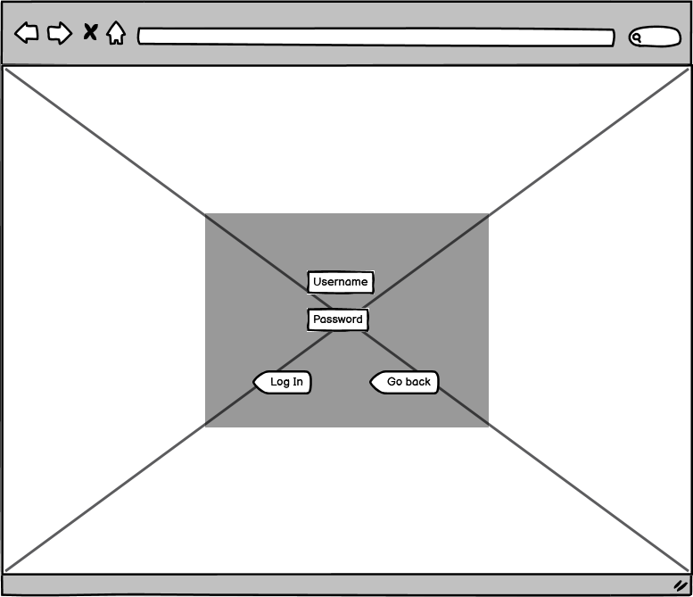
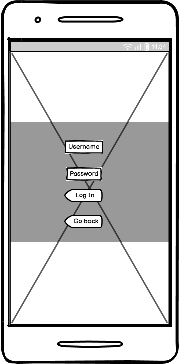

**Product Page:**
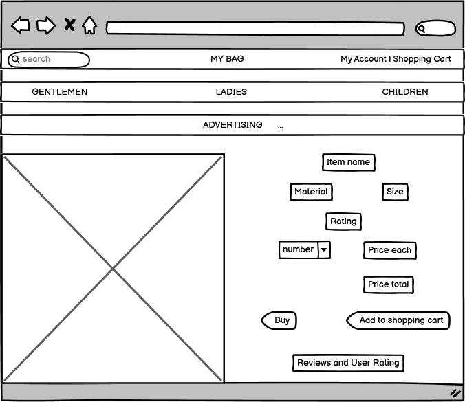
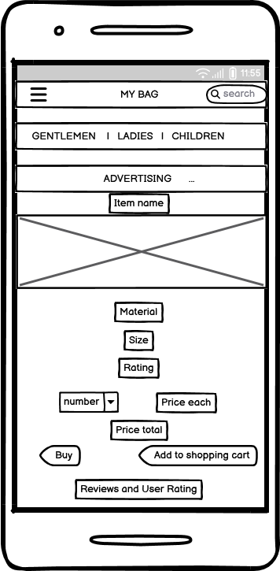

**Shopping Cart:**
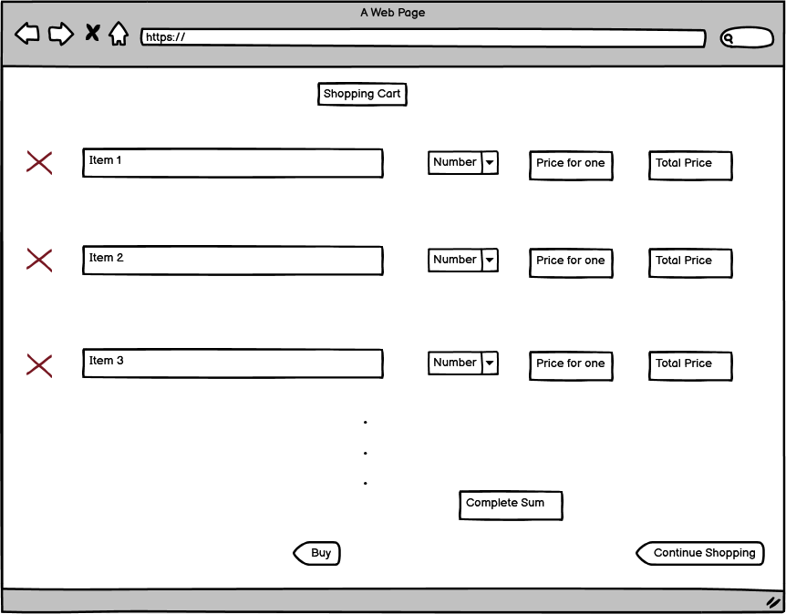
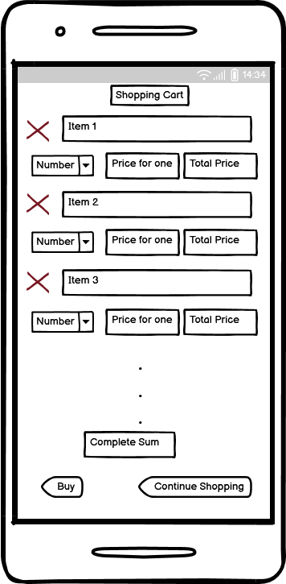

**Personal user page:**
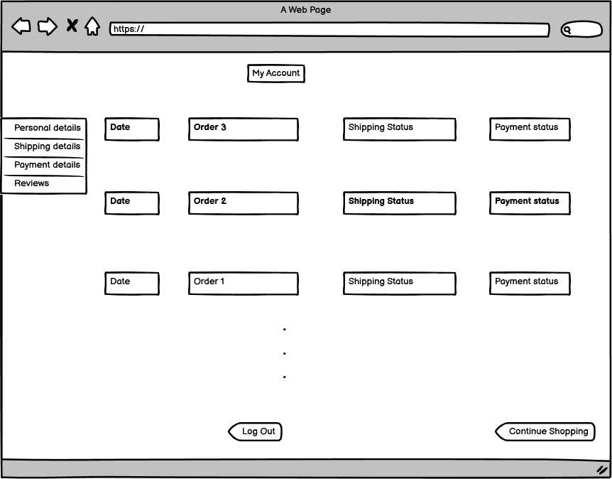
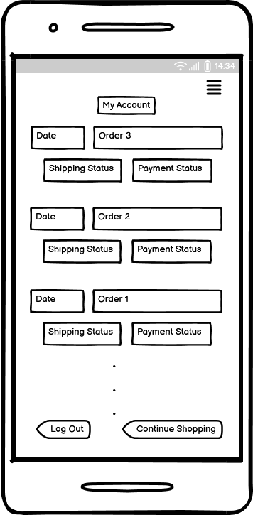

**Add review:**
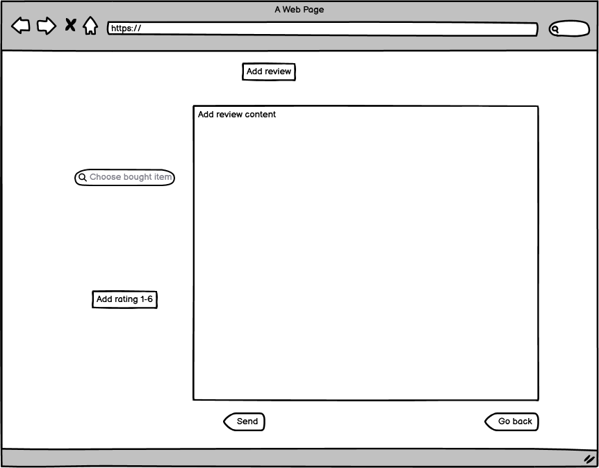
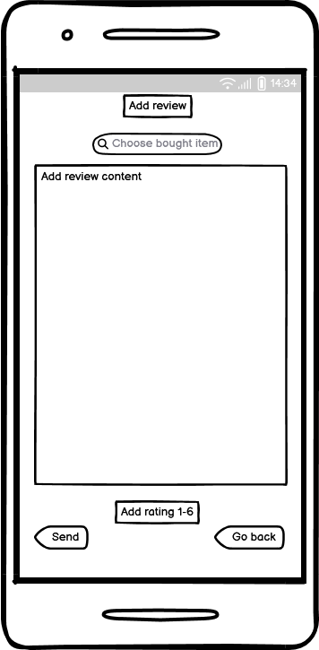

#### Flow Chart

Here is the outlined flow chart:

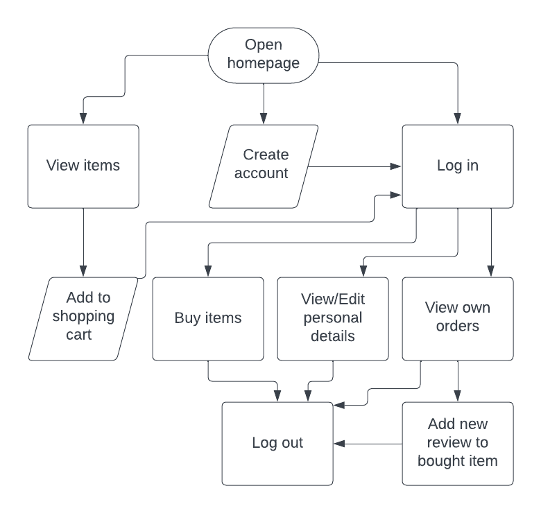

#### Entity Relationship Diagram

Here is the outlined ERD:

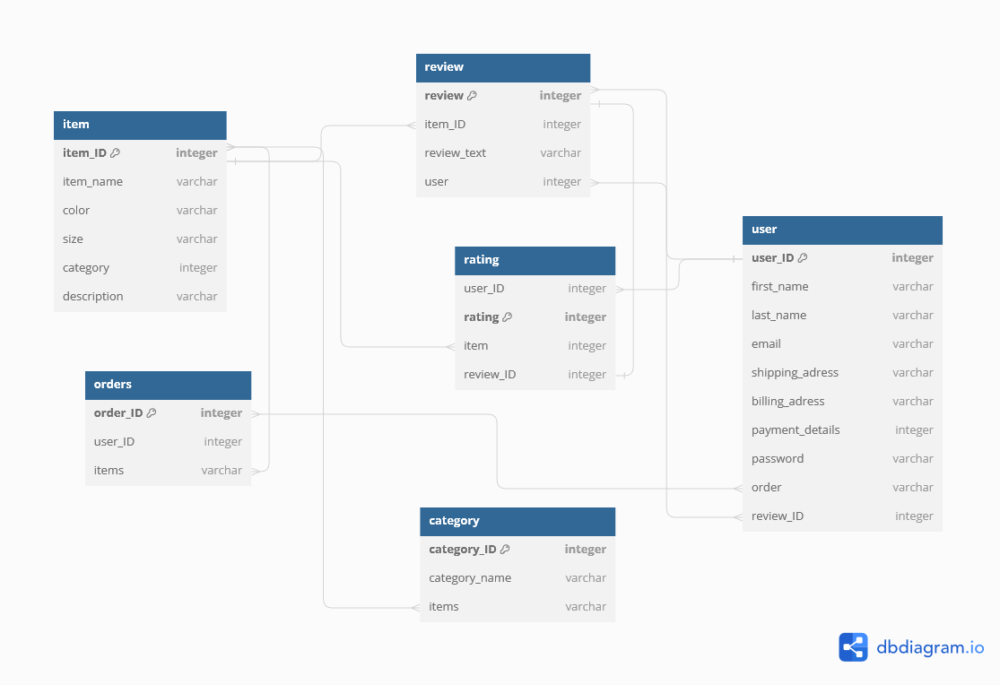

#### Method

##### POC (prove of concept)

- Register
- Log in and out
- Adding reviews with ratings
- View items
- Edit shopping cart
- Edit items
- Edit categories
- Authentification
- payment method
- search and filter function
- image storage

##### MVP (minimum viable product)

- Search and filter items and categories
- Interacting with item
    - view sizes
    - view colors
- Create new account
- Logging in and out of the page
    - Make a new order
        - Adding items
        - Deleting items
        - Change amount of items
    - View orders
        - view order list
        - view order details
        - view shipping and payment status
    - View personal details
        - Edit shipping adress
        - Edit billing adress
        - Edit payment method
- View shopping cart
    - via hover
        - view short overview
    - via clicking
        - view details
        - edit amount of each item
        - delete item
- Edit items/categories
    - delete
    - edit
    - add
        - images
        - description
        - amount    

### Five planes of UX

#### Strategy

#### Scope

#### Structure

#### Skeleton

#### Surface

## Features

### Welcome screen

- 

### User moves

- 

### Features left to implement

There is the possibility to integrate:

- **V2 (version 2)**
    - Advertisement
        - Add
        - Delete
        - Edit

## Used Technologies

### Languages Used

- HTML, CSS, Python, Jinja

### Framework, Libraries and Programs

- Frameworks 
    - Django
    - Bootstrap
- Libraries 
    - 
- Moduls
    - 
- Programs
    - Balsamiq
        - was used to create the wireframes
    - Lucidchart
        - was used to create the flow chart
    - dbdiagram
        - was used to create the entity relationship diagram
    - GitHub
        - was used to store the project site
    - Gitpod
        - was used to write the code and commit it to GitHub
    - Heroku 
        - was used to deploy the project 
    - ElephantSQL
        - was used for storing the database    
    - CI Python Linter
        - was used for finding errors
    - Languagetool
        - was used to check the spelling and grammar in the README file.

## Testing

### Manual testing

- The site was tested on different browsers: Chrome, Firefox and Safari.
- I confirmed that the page is readable.
- I confirmed that questions are functioning.

| **Feature** | **Expect** | **Action** | **Result** |
|---------------------|--------------------|--------------------------|------------------------------|
|  |  |  |  |

### Testing user stories

| **Expectation - User** | **Result**|
|--------------|------------|
| |  |

**As the administrator**

| **Expectation - Administrator** | **Result**|
|--------------|------------|
|  |  |

### Validator testing

- **CI Python Linter**

- **Lighthouse**

### Unfixed bugs

- The comments are acceptable.

## Deployment

The deployment was done after the tutorial in the course content using <https://www.heroku.com/>.

For deployment:
- A Heroku account must be created.
- Set your GitHub repository to public.
- Create a new app in Heroku with the following settings:
  - Add Python and Node.js (in this order!)
  - Add PORT as key and 8000 as value
- The Heroku App must be linked to the correct repo in GitHub
- Choose Automatic Deploys for easier handling.
- Then deploy
 
The link to the live page can be found here: [] (<>)

## Credits

### Content

The content of this project was inspired by the "Boutique Ado" project and the content of the course. In general, the following websites were used for inspiration:
  - <https://developer.mozilla.org/en-US/docs/Learn/Server-side/Django>
  - <https://docs.djangoproject.com/en/4.2/ref/contrib/flatpages/>
  - <https://www.w3schools.com/>
  

Inspirations for specific problems were taken from the following websites:
  - <https://espere.in/Django-Allauth:-How-to-create-social-login-like-Facebook-Google-Github-and-Twitter-in-django/>
  - <https://docs.allauth.org/en/latest/installation/quickstart.html>
  - <https://getbootstrap.com/docs/5.3/getting-started/introduction/>
  - <https://www.strategyzer.com/library/the-business-model-canvas>
  - <https://docs.djangoproject.com/en/5.0/topics/auth/customizing/#extending-the-existing-user-model>
  
### Media

Images were downloaded from <https://pixabay.com/de/>

## Acknowledgements

- I would love to thank the following persons:
  - My mentor for his support
  - The Code Institute tutor support for their fast answers
  - My facilitator for her support
  - The slack community for their fast answers and support