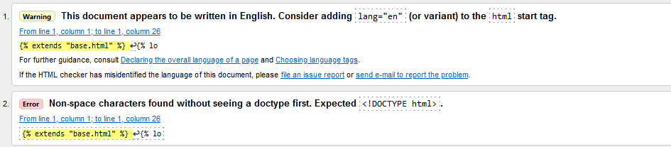
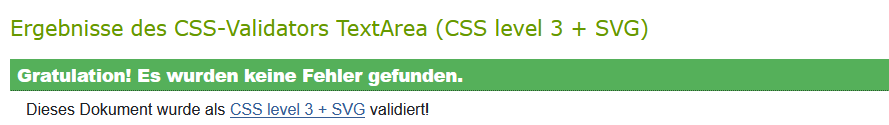
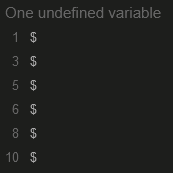
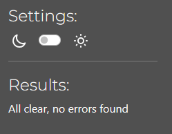

# Table of content

- [Manual testing](#manual-testing)
- [Testing user stories](#testing-user-stories)
- [Validator testing](#validator-testing)
- [Unfixed bugs](#unfixed-bugs)

## Manual testing

- The site was tested on different browsers: Chrome, Firefox and Safari.
- I confirmed that the page is readable.
- I confirmed that everything is functioning.

| **Feature**          | **Expect**                                                                   | **Action**                             | **Result**                                                                                          |
| ----------------------- | ---------------------------------------------------------------------------- | -------------------------------------- | --------------------------------------------------------------------------------------------------- |
| Shop now                | User should be forwarded to all products page                                | click on button                        | Redirection to products page                                                                        |
| Products details        | User should be forwarded to products detail page                             | click on image                         | Redirection to products detail page                                                                 |
| Keep shopping           | User should be able to go back to products form products detail page         | click button                           | Redirection to products page                                                                        |
| Add to shopping cart    | User should be able to add item to shopping cart                             | click on button                        | Item is added to shopping cart                                                                      |
| Shopping cart           | User should be able to view the shopping cart                                | click on icon                          | Redirection to shopping cart                                                                        |
| Udpate item             | User should be able to update quantity in shopping cart                      | add number & click on Update           | Quantity updated                                                                                    |
| Remove item             | User should be able to update quantity in shopping cart                      | click remove                           | Item removed                                                                                        |
| Secure checkout         | User should be able to make a secure checkout from shopping cart             | click on button                        | Redirection to secure checkout                                                                      |
| Add personal detail     | User should able to add personal details for checkout or field are prefilled | add details                            | Details are displayed or added                                                                      |
| Adjust Shoppingcart     | User should be able to adjust shoppingcart                                   | click button                           | Redirection to shopping cart                                                                        |
| Complete order          | User should be able to complete the order                                    | click button                           | Redirection to thank you for your order page                                                        |
| Continue shopping       | User should be able to continue shopping after purchase                      | click button                           | Redirection to products page                                                                        |
| Keep shopping           | User should be able to go back to products form shopping cart                | click button                           | Redirection to products page                                                                        |
| Mainpage                | User should be able to go back to main page                                  | click on MyBag or Home in navbar       | Redirection to landing page                                                                         |
| Login                   | User should be forwarded to sign-in page                                     | click on button                        | Redirection to sign-in page                                                                         |
| Update Information      | User should be able to update personal information in profile                | click on button                        | Information updated                                                                                 |
| Old orders              | User should be able to view details of old orders in profile                 | click on order number                  | Redirection to thank you for your order page with details                                           |
| Back to profile         | User should be able to go back to profile from old order information         | click on button                        | Redirection to profile                                                                              |
| Sign-in                 | User should be forwarded to the homepage as login                            | fill in details and click on button    | Redirection to the homepage as logged-in user                                                       |
| Logout                  | User should be forwarded to confirmation page                                | click on button                        | Redirection to confirmation page                                                                    |
| Logout confirmation     | User should be forwarded to homepage                                         | click on button                        | Redirection to the homepage                                                                         |
| Register                | User should be forwarded to signup form                                      | click on button                        | Redirection to signup form                                                                          |
| Signup                  | User should be forwarded to the homepage as logged-in user                   | fill in details and click on button    | Redirection to the homepage as logged-in user                                                       |
| Choose Category         | User should be able to choose the wanted category                            | click the wanted buttons in the navbar | Redirection to chosen page                                                                          |
| Forum details           | User should be able to see whole article                                     | click on read more                     | Redirection to single article                                                                       |
| Forum category          | User should be able to select a specific category                            | click on button                        | Redirection to category                                                                             |
| Back to forum           | User should be able to go back to forum page                                 | click on back to overview              | Redirection to forum page                                                                           |
| Submit comment          | User should be able to type in text and submit it                            | type and click on button               | Text box can be used and after clicking submission the comment can be seen as waiting for approval. |
| Social media            | User should be forwarded to facebook                                         | click on icon                          | Facebook opens in another tab                                                                       |
| Privacy Policy          | User should be forwarded to privacy policy                                   | click on privacy policy          | Redirection to privacy policy                                                                       |
| Newsletter subscription | User should be able to subscribe                                             | enter email adress and click subscribe | Confirmation is shown                                                                               |

## Testing user stories

| **Expectation - As a sopper/site user**                                                                                                                                                                    | **Result**                                                                |
| ---------------------------------------------------------------------------------------------------------------------------------------------------------------------------------------- | --------------------------------------------------------------------- |
| I want to be able to view a list of products so that I can select some to purchase.                                                                                                      | A list of products can be viewed.                                     |
| I want to be able to view individual product details so that I can identify the price, description, product rating and product image.                                                    | A detailed view can be opened.                                        |
| I want to be able to quickly identify deals, clearance items and special offers so that I can take advantage of special savings on products I’d like to purchase.                        | So far a sales category is included.                                  |
| I want to be able to easily view the total of my purchase at any time so that I can avoid spending too much.                                                                             | The shoppingcart can be opened easily.                                |
| I want to be able to easily register for an account so that I can have a personal account and be able to view my profile.                                                                | An account registration is possible.                                  |
| I want to be able to easily login or logout so that I can access my personal account information.                                                                                        | It is easy to login and logout                                        |
| I w.ant to be able to easily recover my password in case I forget it so that I can recover access to my account.                                                                         | Custom password recovery is about to come.                            |
| I want to be able to receive an email confirmation after registering so that I can verify that my account registration was successful.                                                   | Email for registration has to be verified.                            |
| I want to be able to have a personalized user profile so that I can view my personal order history and order confirmations, and save my payment information.                             | Personal information can be saved as well as the order history.       |
| I want to be able to sort the list of available products so that I can easily identify the best rated, best priced and categorically sorted products.                                    | Sorting the available products is possible.                           |
| I want to be able to sort a specific category of product so that I can find the best-priced or best-rated product in a specific category, or sort the products in that category by name. | Specific categories can be viewed and sorted.                         |
| I want to be able to sort multiples categories of products simultaneously so that I can find the best-priced or best-rated products across broad categoried, such as „school bags“.      | Via the searchbar special keywords can be searched across categories. |
| I want to be able to search for a product by name or description so that I can find a specific product I’d like to purchase.                                                             | Via the searchbar special keywords can be searched across categories. |
| I want to be able to easily see what I’ve searched for and the number of results so that I can quickly decide whether the product I want is available.                                   | The keyword and results number are displayed.                         |
| I want to be able to easily select quantity of a product when purchasing it so that I can ensure I don’t accidentially select the wrong product or quantity.                             | Quantity can easily be selected.                                      |
| I want to be able to view items in my shopping cart to be purchased so that I can identify the total cost of my purchase and all items I will receive.                                   | Shopping cart can be viewed at all times.                             |
| I want to be able to adjust the quantity of individual items in my bag so that I can easily make changes to my purchase before checkout.                                                 | Quantity of items can be adjusted in the shopping cart.               |
| I want to be able to easily enter my payment information so that I can check out quickly and with no hassle.                                                                             | Payment information can easily be entered.                            |
| I want to be able to feel my personal and payment information is safe and secure so that I can confidently provide the needed information to make a purchase.                            | Login required is set where needed.                                   |
| I want to be able to view an order confirmation after checkout so that I can verify that I haven’t made any mistakes.                                                                    | Order confirmation after checkout is automatically displayed.         |
| I want to be able to receive an email confirmation after checking out I want to be able to  so that I can keep the confirmation of what I’ve purchased for my records.                   | An email confirmation is going to be sent automatically.              |

**As the administrator**

| **Expectation - Administrator**                                                                                                   | **Result**                                              |
| --------------------------------------------------------------------------------------------------------------------------------- | ------------------------------------------------------- |
| I want to be able to add a product so that I can add new items to my store.                                                       | Products can be added.                                  |
| I want to be able to edit/update a product so that I can change product prices, descriptions, images, and other product criteria. | Products can be updated or edited.                      |
| I want to be able to delete a product so that I can remove items that are no longer for sale.                                     | Products can be deleted.                                |
| I want to be able to add/edit/delete a category so that I can change the items available in my store.                             | Category adding/editing/deleting has to be added.       |
| I want to be able to add/edit/delete advertisements so that I can promote different product or campaign.                          | Products can be moved in and out of the sales category. |

**As developer**
| **Expectation - Developer**                                                                                                                              | **Result**                                                               |
| -------------------------------------------------------------------------------------------------------------------------------------------------------- | ------------------------------------------------------------------------ |
| I want to be able to write User Stories, Milestones and set up the Kanban Board for the project so that I can keep track of the progress of the project. | All User Stories, Milestones are written and the Kanban Board is set up. |
| I want to be able to use wireframes, flowchart and ERD so that I can built the wanted site.                                                              | Wireframes, flowchart and ERD are drawn.                                 |
| I want to be able to deploy my project early so that I can find problems and avoid stress in the end.                                                    | Project was deployed later than expected.                                |
| I want to be able to finish the Readme File so that I can finish the project.                                                                            | Readme File is about to be finished.                                     |
| I want to be able to make the final deployment so that I can submit a working project.                                                                   | Final deployment is about to come                                        |

## Validator testing

- **Validator W3**

The exemplary test results: 

- **Validator W3C**

The exemplary test results: 

- **JSHint**

The exemplary test results: 

- **CI Python Linter**

The exemplary test results: 

- **Lighthouse**

## Unfixed bugs

- The errors and warnings are django or jquery specific and therefore acceptable.